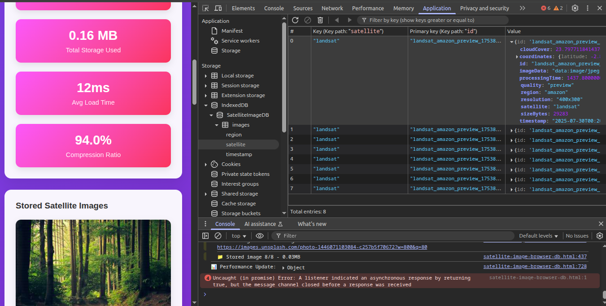

# 🛰️ Satellite Image Browser Database

A comprehensive demonstration of advanced browser storage techniques and DevTools integration using real satellite imagery. This application showcases how to handle large datasets (up to 25MB per image) in the browser using IndexedDB, with professional satellite image processing and real-time performance monitoring.

 
 




## 📋 Table of Contents

- [Features](#-features)
- [Live Demo](#-live-demo)
- [Installation](#-installation)
- [Usage Guide](#-usage-guide)
- [DevTools Integration](#-devtools-integration)
- [Technical Architecture](#-technical-architecture)
- [Performance Considerations](#-performance-considerations)
- [Browser Compatibility](#-browser-compatibility)
- [Troubleshooting](#-troubleshooting)
- [Contributing](#-contributing)
- [Educational Use Cases](#-educational-use-cases)

## ✨ Features

### Core Functionality
- **Real Satellite Imagery**: Fetches actual satellite and aerial photos from multiple regions
- **Advanced IndexedDB Storage**: Efficiently stores large image datasets with metadata
- **Multi-Quality Support**: Preview (500KB) to Ultra (25MB) per image
- **Regional Coverage**: Amazon, Sahara, Himalayas, Arctic, Great Barrier Reef
- **Multiple Satellite Sources**: Landsat 8/9, Sentinel-2, MODIS Terra, WorldView-3

### Professional Features
- **Satellite Overlays**: Authentic scan lines, GPS coordinates, timestamps
- **Performance Monitoring**: Real-time load times, compression ratios, memory usage
- **Smart Fallbacks**: Automatic pattern generation if images fail to load
- **Progressive Loading**: Non-blocking UI updates during image generation
- **Storage Quotas**: Intelligent memory management with usage warnings

### Developer Tools Integration
- **DevTools Hooks**: Console commands for database inspection
- **Performance Profiling**: Built-in timing and memory usage tracking  
- **Network Monitoring**: Real-time image fetch performance
- **Storage Inspector**: Visual IndexedDB data exploration
- **Error Handling**: Comprehensive logging and fallback mechanisms

## 🚀 Live Demo

You can run this application immediately by copying the HTML file and opening it in any modern browser. No server setup required!

## 📥 Installation

### Option 1: Direct Download
```bash
# Clone or download the HTML file
curl -O https://your-repo/satellite-image-db.html
# Open in browser
open satellite-image-db.html
```

### Option 2: Local Server (Recommended for CORS)
```bash
# Using Python
python -m http.server 8000

# Using Node.js
npx http-server

# Using PHP
php -S localhost:8000
```

### Option 3: Online Deployment
Deploy to any static hosting service:
- GitHub Pages
- Netlify
- Vercel
- CodePen

## 📖 Usage Guide

### Basic Operation

1. **Select Parameters**
   - **Satellite Source**: Choose from Landsat, Sentinel-2, MODIS, or WorldView-3
   - **Region**: Pick from 5 geographic regions with distinct terrain
   - **Image Quality**: Select from Preview to Ultra quality (affects file size)

2. **Generate Images**
   - Click "Generate Images" to fetch real satellite imagery
   - Monitor progress in the console and stats panel
   - Images are automatically stored in IndexedDB

3. **View and Analyze**
   - Browse generated images in the grid view
   - Click any image to view full-size with detailed metadata
   - Monitor storage usage and performance metrics

### Advanced Features

#### Quality Settings
| Quality | Resolution | File Size | Use Case |
|---------|------------|-----------|----------|
| Preview | 400x300 | ~500KB | Quick testing |
| Standard | 800x600 | ~2MB | General use |
| High | 1600x1200 | ~8MB | Detailed analysis |
| Ultra | 3200x2400 | ~25MB | Maximum detail |

#### Regional Datasets
- **Amazon Rainforest**: Dense forest canopy and deforestation patterns
- **Sahara Desert**: Sand dunes and desert landscape formations
- **Himalayan Range**: Snow-covered peaks and alpine terrain
- **Arctic Ice**: Ice formations and polar landscape changes
- **Great Barrier Reef**: Coral reef systems and ocean patterns

## 🔧 DevTools Integration

### Essential DevTools Workflows

#### 1. Storage Inspection
```javascript
// Open DevTools → Application → IndexedDB → SatelliteImageDB
// Inspect stored images and metadata
console.log(await window.satelliteDB.getAllImages());
```

#### 2. Performance Monitoring
```javascript
// Check current statistics
window.satelliteDB.stats();

// Monitor memory usage
console.log(performance.memory);
```

#### 3. Network Analysis
- Open **Network Tab** before generating images
- Filter by images to see fetch performance
- Analyze load times and file sizes

#### 4. Memory Profiling
- Use **Memory Tab** to track heap usage
- Take snapshots before/after image generation
- Identify potential memory leaks

### Console Commands
```javascript
// Get database statistics
window.satelliteDB.stats()

// Access raw database
window.satelliteDB.db

// Clear all stored images
window.satelliteDB.clearDatabase()

// Get all images with metadata
window.satelliteDB.getAllImages()
```

## 🏗️ Technical Architecture

### Storage Layer
```
IndexedDB (SatelliteImageDB)
├── Object Store: "images"
├── Indexes:
│   ├── region (non-unique)
│   ├── satellite (non-unique)
│   └── timestamp (non-unique)
└── Data Structure:
    ├── id (primary key)
    ├── imageData (base64 blob)
    ├── metadata {...}
    └── performance metrics
```

### Image Processing Pipeline
```
1. Fetch Remote Image → 2. Canvas Processing → 3. Satellite Overlays
        ↓                      ↓                     ↓
4. Compression → 5. Blob Creation → 6. IndexedDB Storage
```

### Performance Monitoring
- **Load Time Tracking**: Average fetch and processing times
- **Memory Usage**: Heap size monitoring with warnings
- **Compression Ratios**: Efficiency calculations
- **Storage Quotas**: Browser limit awareness

## ⚡ Performance Considerations

### Memory Management
- **Ultra Quality**: Generates only 3 images to prevent memory issues
- **Progressive Loading**: Updates UI incrementally to avoid blocking
- **Automatic Warnings**: Alerts when storage exceeds 100MB
- **Garbage Collection**: Proper cleanup of canvas contexts

### Optimization Tips
1. **Start with Preview quality** for initial testing
2. **Monitor browser memory** in DevTools during generation
3. **Clear database regularly** when testing different configurations
4. **Use Network throttling** to simulate slower connections

### Browser Limits
| Browser | IndexedDB Limit | Recommended Max |
|---------|----------------|-----------------|
| Chrome | ~80% of disk space | 500MB |
| Firefox | ~50% of disk space | 300MB |
| Safari | ~1GB | 200MB |

## 🌐 Browser Compatibility

### Fully Supported
- **Chrome 50+** ✅ (Recommended)
- **Firefox 44+** ✅
- **Safari 10+** ✅
- **Edge 79+** ✅

### Required APIs
- IndexedDB v2
- Canvas API
- FileReader API
- Fetch API
- Blob/ArrayBuffer support

### Feature Detection
The application includes automatic feature detection:
```javascript
if (!window.indexedDB) {
    console.error('IndexedDB not supported');
}
```

## 🔍 Troubleshooting

### Common Issues

#### Images Not Loading
```
Problem: Blank or missing images
Solution: 
1. Check browser console for CORS errors
2. Ensure internet connection is stable
3. Wait for fallback patterns to generate
4. Try different quality settings
```

#### Storage Quota Exceeded
```
Problem: "QuotaExceededError" in console
Solution:
1. Clear existing images with "Clear Database"
2. Reduce image quality settings
3. Generate fewer images at once
4. Check available disk space
```

#### Performance Issues
```
Problem: Browser becomes unresponsive
Solution:
1. Reduce to Preview quality
2. Generate fewer images
3. Close other browser tabs
4. Restart browser if needed
```

#### DevTools Not Showing Data
```
Problem: IndexedDB appears empty in DevTools
Solution:
1. Refresh DevTools (F12 → F5)
2. Check "SatelliteImageDB" → "images" store
3. Ensure images were generated successfully
4. Try different DevTools panel
```

## 🎓 Educational Use Cases

### For Web Developers
- **IndexedDB Mastery**: Learn advanced browser storage techniques
- **Performance Optimization**: Understand large data handling
- **DevTools Proficiency**: Master browser debugging tools
- **Canvas Processing**: Image manipulation and compression

### For Data Scientists
- **Browser-Based Analysis**: Client-side data processing patterns
- **Storage Optimization**: Compression and efficiency techniques
- **Performance Metrics**: Real-time monitoring implementations
- **Metadata Management**: Structured data organization

### For Students
- **Modern Web APIs**: Practical implementation examples
- **Database Design**: NoSQL patterns in the browser
- **Performance Engineering**: Memory and storage optimization
- **Debugging Techniques**: Professional DevTools workflows

## 🛠️ Contributing

### Development Setup
```bash
git clone https://github.com/your-repo/satellite-image-db
cd satellite-image-db
# No build process needed - pure HTML/JS/CSS
```

### Adding New Features
1. **New Regions**: Add image URLs to `satelliteImageSources`
2. **Quality Levels**: Modify `qualitySettings` object
3. **Satellite Sources**: Extend dropdown options
4. **Processing Effects**: Enhance `addSatelliteOverlay` function

### Code Style
- ES6+ JavaScript features
- Semantic HTML structure
- CSS Grid/Flexbox for layouts
- Comprehensive error handling
- Console logging for debugging

## 📄 License

MIT License - Feel free to use this for educational and commercial purposes.

## 🔗 Related Resources

- [IndexedDB API Documentation](https://developer.mozilla.org/docs/Web/API/IndexedDB_API)
- [Chrome DevTools Guide](https://developers.google.com/web/tools/chrome-devtools)
- [Canvas API Reference](https://developer.mozilla.org/docs/Web/API/Canvas_API)
- [Browser Storage Best Practices](https://web.dev/storage-for-the-web/)

---

**Built for the Chrome for Developers community** - showcasing cutting-edge browser capabilities and professional debugging techniques.

*Perfect for demonstrating modern web storage, performance optimization, and DevTools integration!* 🚀